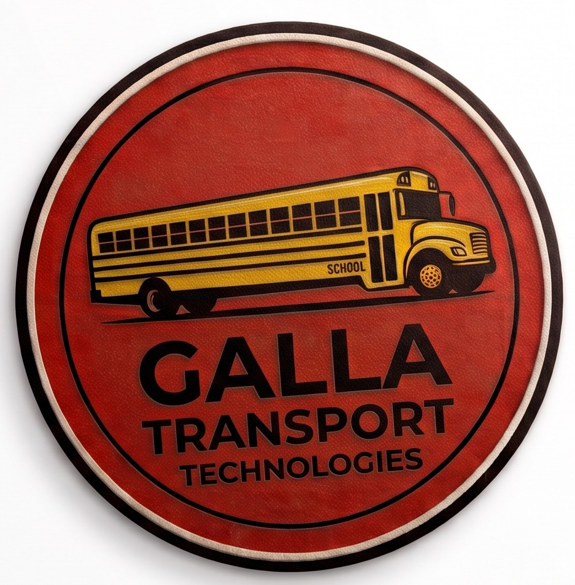

<h1 align="center"><strong>Tiger Transport</strong></h1>

<em>Powered by Galla Transport Technologies LLC</em>

Modern hardware and software logistics solutions engineered for school transportation, student accountability, and fleet operations.

---

### Solutions & Platforms

* **Student Transportation Logging:** Real-time student manifest tracking and onboard NFC scanning to verify route loading and drop-offs.
* **Fleet Maintenance Systems:** Digital workshop inventory workflows, diagnostics tracking, and preventative fleet scheduling.

---

### Transparency & Compliance

* [Privacy Policy](privacy) — Learn how we handle and protect operational and student data.

---

### Support & Inquiries

**Galla Transport Technologies LLC**  
Macon, Missouri  
*Contact:* gallatransporttechnologies@gmail.com

<footer>
  <a href="/sitemap.xml">Sitemap</a>
</footer>
  
